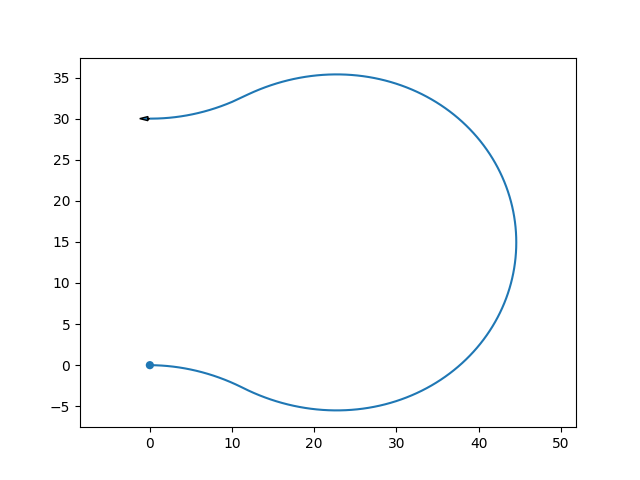
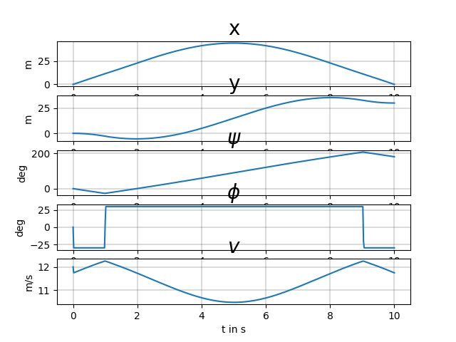

## Trajectory planning

### Opty

[Repository github](https://github.com/csu-hmc/opty), [Documentation](https://opty.readthedocs.io/en/latest/theory.html)

### Implémentation
   
[06_optyplan.py](https://github.com/poine/projet_dronisos_guidage/blob/master/src/06_optyplan.py)

#### Example 0

#### Example 7

