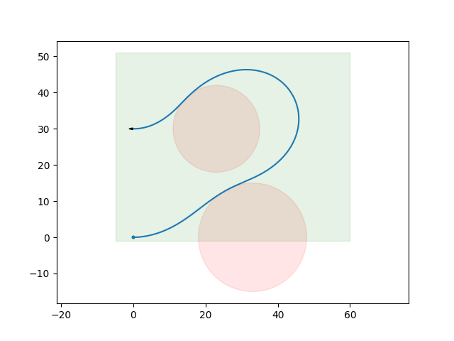
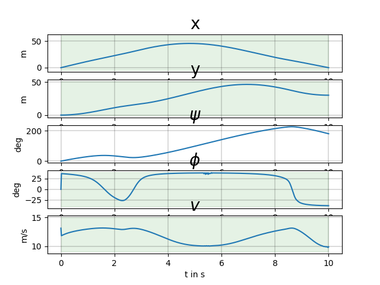

## Trajectory planning

### 1: Opty

`opty utilizes symbolic descriptions of differential algebraic equations expressed with SymPy to form the constraints needed to solve optimal control and parameter identification problems using the direct collocation method and non-linear programming.`

  * [Repository github](https://github.com/csu-hmc/opty)
  * [Documentation](https://opty.readthedocs.io/stable/)
  

### 2: Single Vehicle Implementation

  * [d2d/opty_utils.py](https://github.com/poine/projet_dronisos_guidage/blob/master/src/d2d/opty_utils.py)
	synbolic equations of motion, cost functions, plotting, etc...
  * [d2d/optyplan_scenarios.py](https://github.com/poine/projet_dronisos_guidage/blob/master/src/d2d/optyplan_scenarios.py)
	scenarios (experiments) 
  * [06_optyplan.py](https://github.com/poine/projet_dronisos_guidage/blob/master/src/06_optyplan.py)
	Planner
	
#### Example 0

  * Specification of start/end position and time
  * Bank and velocity contraints
  * Mean velocity cost function

#### Example 3

Constraints on state variables, obstacles (in cost function)

#### Example 7

Several independant planifications

### 3: Multiple Vehicles Implementation

[07_multioptyplan.py](https://github.com/poine/projet_dronisos_guidage/blob/master/src/07_multioptyplan.py)
